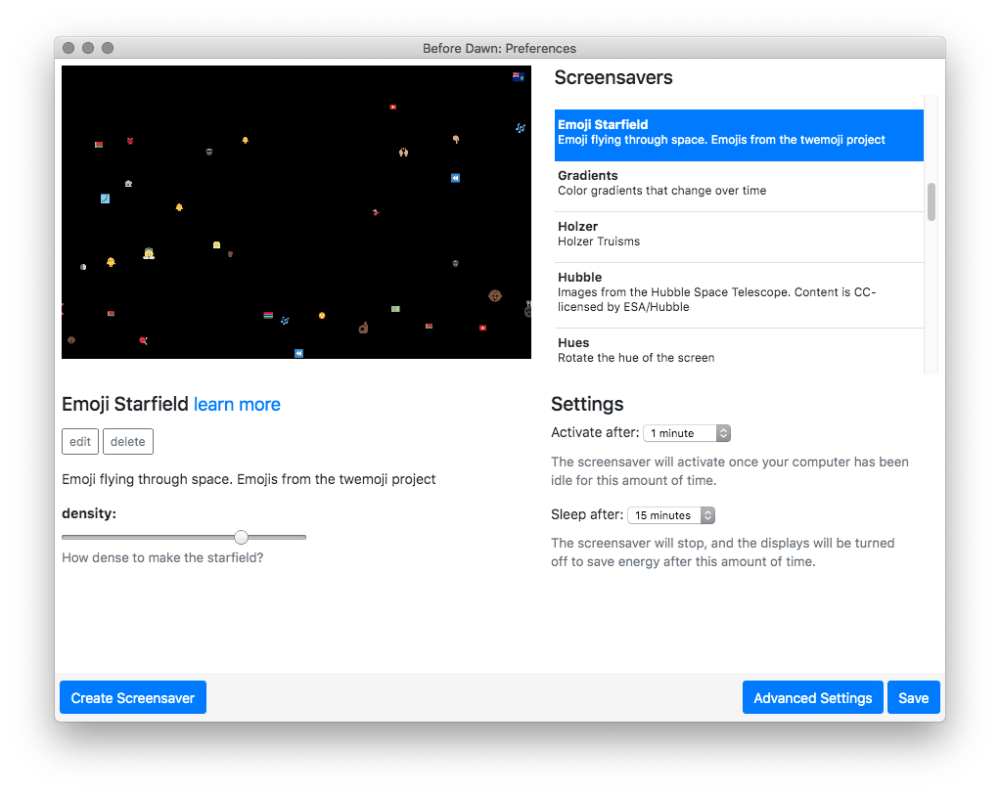
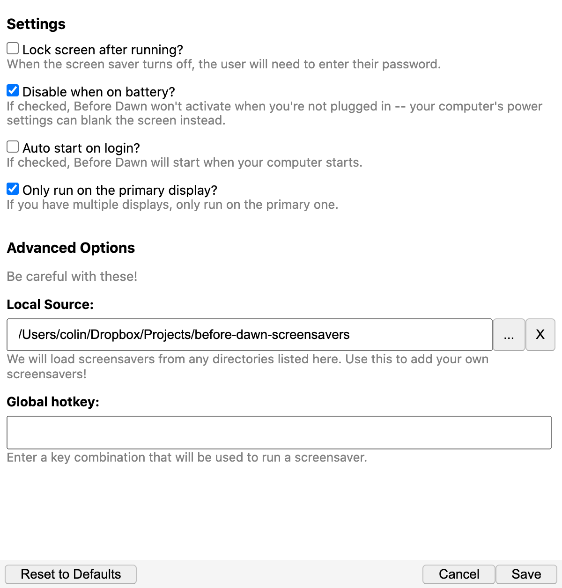
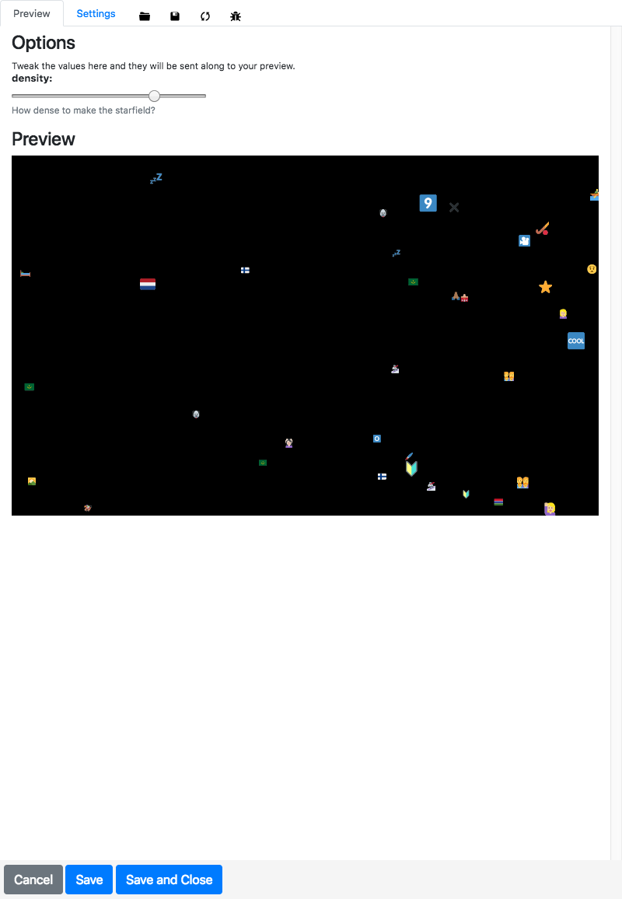
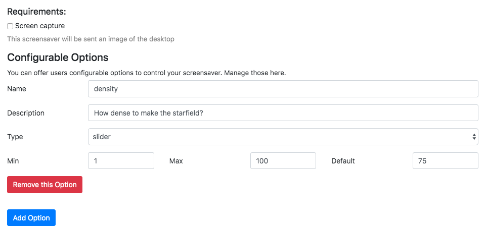

# Before Dawn

Before Dawn is a an open-source, cross-platform screensaver
application using web-based technologies. You can generate
screensavers with it using HTML/CSS, javascript, canvas, and any tools
that rely on those technologies. In theory, generating a Before Dawn
screensaver is as simple as writing an HTML page.

The project developed out of a personal project to explore the history
of early screensavers. I decided that I wanted to write a framework
that I could use to actually run screensavers on my computer. I wanted
it to be cross-platform and easily accessible to artists and
developers.

Before Dawn is definitely a bit of a experiment -- to actually use it,
you need to run it as a separate application on your computer and
disable whatever screensaver you have running in your OS, but it is
fun and definitely works.

The core of the app is built on [Electron](http://electron.atom.io/),
a system that allows you to build desktop applications that run on
[node.js](https://nodejs.org/) and are rendered via Chrome.

There's about a dozen screensavers right now, with more on the
way. Here's the Flying Emoji screensaver:

You can get a quick preview of the other screensavers via this
[preview page](http://muffinista.github.io/before-dawn-screensavers/).

The first time you open the application, the preferences window will open. You
can preview and pick screensavers there:

There's an 'Advanced Settings' section where you can specify certain options for how the
application should run.

## Downloads

Installers are available from the [releases](https://github.com/muffinista/before-dawn/releases) page.

## Status

Right now the application itself is pretty stable. This repo includes the main
code for running the actual screensaver, a simple app for picking your
screensaver and setting some options, and a bunch of modules to pull it all
together.

The actual code for the screensavers is in [a separate
repo](https://github.com/muffinista/before-dawn-screensavers). If you want to
write a screensaver, please add it to the project via a PR!

## Running It

The easiest way to use the tool is to install it to your computer. You
can grab an installer from the
[releases](https://github.com/muffinista/before-dawn/releases) page.
Binaries are available for OSX and Windows, and there's an experimental 
release for Ubuntu/Debian.

Once it's running, there will be a sunrise icon in your system tray,
with a few different options. If you click 'Preferences,' you can
preview the different screensavers, set how much idle time is required
before the screensaver starts to run, specify custom paths, etc.

Once you've set all of that up, Before Dawn will happily run in the
background, and when it detects that you have been idle, it will
engage your screensaver. That's all there is to it!

## Building It

Steps for generating your own build Before Dawn are listed in
[the wiki](https://github.com/muffinista/before-dawn/wiki/Building-Before-Dawn)

## Hacking It

If you would like to hack on Before Dawn, there's some instructions on
the
[Development page](https://github.com/muffinista/before-dawn/wiki/Development)
in the wiki. It's pretty straightforward once you have a basic setup
in place.

## How to Write a Screensaver

A Before Dawn screensaver is basically just a web page running in
fullscreen mode. That said, there's a few twists to make it run as
smoothly as possible. There's a bunch of specific implementation
details in
[the wiki](https://github.com/muffinista/before-dawn/wiki/Writing-A-Screensaver).

There's also a very basic editor mode built into Before Dawn, which will
generate some basic code for you to work from, and will make it easier to add
some configurable options to your work.

The editor has a simple preview, a form to describe the screensaver, and a
section where you can add custom options for your screensaver:

## Contributing

Contributions and suggestions are eagerly accepted. Please check out
the
[code of conduct](https://github.com/muffinista/before-dawn/blob/main/code_of_conduct.md)
before contributing.

If you find a bug or have a suggestion, you can open an issue or a
pull request here.

If you would like to add a screensaver to the program, you can submit
a PR to the
[before-dawn-screensavers](https://github.com/muffinista/before-dawn-screensavers)
repo.

I will accept pretty much any pull request to the repository given
that the content you are posting is legal and appropriate. If you need
help or have a suggestion, please feel free to open an issue here.

## Copyright/License

Unless otherwise stated, Copyright (c) 2019 [Colin
Mitchell](http://muffinlabs.com).

Before Dawn is is distributed under the MIT licence -- Please see LICENSE.txt
for further details.

